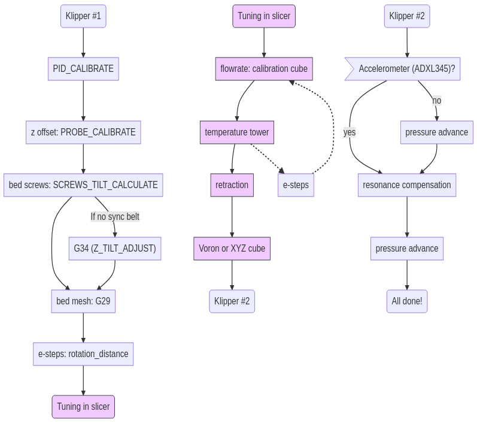
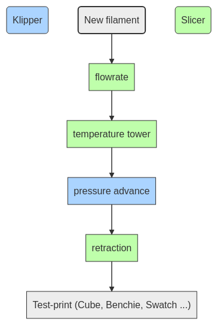

## 3d-printing
My notes, tips, and setup for 3d printing

### Table of contents
- [Printer: Artillery Genius](#printer--artillery-genius)
- [Current mods/software in use](#current-modssoftware-in-use)
  * [Hardware](#hardware)
  * [Printed mods](#printed-mods)
  * [Software](#software)
- [Leveling process](#leveling-process)
- [Replacement parts](#replacement-parts)
- [Printing with PETG](#printing-with-petg)
- [Misc tips](#misc-tips)
- [Useful links](#useful-links)
- [Calibration flowchart](#calibration-flowchart)
- [Filament flowchart](#filament-flowchart)

<tiny><i><a href='http://ecotrust-canada.github.io/markdown-toc/'>Table of contents generated with markdown-toc</a></i></tiny>

## Printer: Artillery Genius
- build size 220\*220\*250 mm
- direct drive
- bed max temperature 130C
- hot end
  - 24V, kraken heatbreak, e3d volcano nozzle & block, nt100 thermistor

## Current mods/software in use
### Hardware
- Raspberry Pi 3 Model B Rev 1.2
- 3DTouch leveling sensor
- mellow/trianglelab nozzle
- full-metal heatbreak
- Bigtreetech TMC2209 v1.2 stepper drivers, in uart mode
  - [A guide for uart mode by @Dan;#1256](https://docs.google.com/document/d/1MyUdEjQ_6hr7yFaBdw0NXcICgTD9j5_0CI363yzLEuU/edit)
- Energetic flexible spring steel & PEI sheet
- ADXL345 accelerometer, (https://www.klipper3d.org/Measuring_Resonances.html)
- At some point, maybe:
  - Improvements for Z-banding: miagi, cobra
  - Side bed cable mod
  - Aluminium bed

### Printed mods
  - fan shroud, (https://www.thingiverse.com/thing:3972011)
    - mount and calibration disk, (https://www.thingiverse.com/thing:3716043)
  - z rod supports, (https://www.thingiverse.com/thing:4444589)
  - cable protector, (https://www.thingiverse.com/thing:4295171)
  - cable ribbon clamp, (https://www.thingiverse.com/thing:4281143)
  - bed cable strain relief, (https://www.prusaprinters.org/prints/55642-genius-zx-adjustable-bed-cable-strain-relief)
  - filament dust filter, (https://www.thingiverse.com/thing:190118)
  - cable chain

### Software
- [Klipper](https://www.klipper3d.org/Overview.html)
  - pressure advance, input shaping, auto bed leveling
  - [Clank's config used as the base](https://github.com/Clank50AE/Clanks-Klipper-Configs)
  - both [Mainsail](https://docs.mainsail.xyz/) and Fluidd installed
- [SuperSlicer](https://github.com/supermerill/SuperSlicer/releases)

## Leveling process
- heat up the bed and wait for a few minutes
- PROBE_CALIBRATE
- take A5 sized copy paper
- close the gap between the nozzle and the bed until you can still move the paper by pulling, but can't move the paper by pushing without it curling up

## Replacement parts
- nozzle: volcano
  - aliexpress: trianglelabs or mellow
- heat block: volcano
- heatbreak
  - if the cooler plate has two holes: smooth heatbreak, "kraken" style

## Printing with PETG
- spread gluestick to bed, dilute with water if needed
- increase the gap between nozzle and bed
- bed temperature: first layer 80C, others 70C
- nozzle temperature >230C
- decrease part cooling

## Misc tips
- [Tape out the 5V line from Pi to mainboard](https://community.octoprint.org/t/put-tape-on-the-5v-pin-why-and-how/13574)
- Detach the 2-wired reset connector between TFT and mainboard: when flashing (Marlin) firmware, keep the reset button pressed to keep the TFT off
- After changing nozzle/hotend
  - Heat up to 230C, loosen nozzle, tighten heat block, tighten nozzle
  - PROBE\_CALIBRATE, TESTZ Z=-1 etc, ACCEPT, SAVE\_CONFIG
  - PID\_CALIBRATE HEATER=extruder TARGET=200, if needed, with fan on
  - heat up the bed and G29

## Useful links
- [Setting up your new Artillery 3D printer](https://artillery.n3t.ro/setup.html)
- [Teaching Tech 3D Printer Calibration](https://teachingtechyt.github.io/calibration.html)

## Calibration flowchart
Flowchart was done using [Mermaid](https://mermaid-js.github.io/mermaid-live-editor/).

## Filament flowchart
My procedure for tuning new filament

