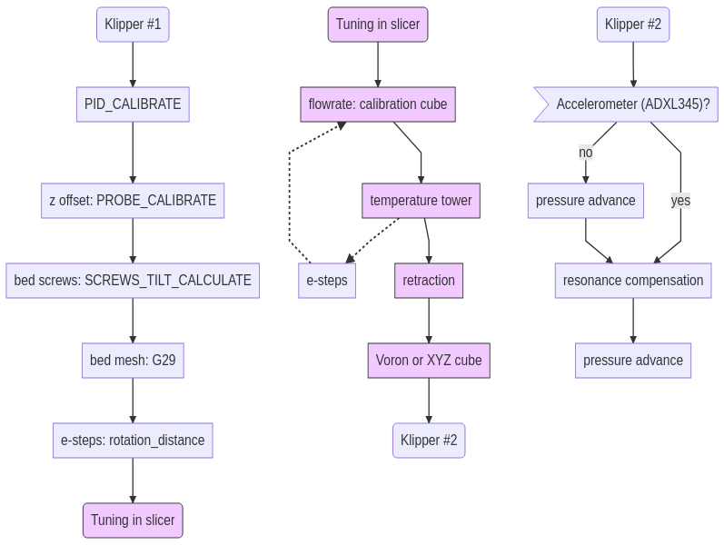

## 3d-printing
My notes, tips, and setup for 3d printing

### Table of contents
- [Printer: Artillery Genius](#printer--artillery-genius)
- [Current mods/software in use](#current-mods-software-in-use)
  * [Hardware](#hardware)
  * [Software](#software)
- [Leveling process](#leveling-process)
- [Replacement parts](#replacement-parts)
- [Misc tips](#misc-tips)
- [Useful links](#useful-links)
- [Calibration flowchart](#calibration-flowchart)
- [Cobra versions](#cobra-versions)

<tiny><i><a href='http://ecotrust-canada.github.io/markdown-toc/'>Table of contents generated with markdown-toc</a></i></tiny>

## Printer: Artillery Genius
- build size 220\*220\*250 mm
- direct drive
- bed max temperature 130C
- hot end
  - 24V
  - kraken heatbreak, e3d volcano nozzle & block, nt100 thermistor

## Current mods/software in use
### Hardware
- Raspberry Pi 3 Model B Rev 1.2
- 3DTouch leveling sensor
- mellow's nozzle
- printed mods
  - fan shroud, (https://www.thingiverse.com/thing:3972011)
    - mount and calibration disk, (https://www.thingiverse.com/thing:3716043)
  - z rod supports, (https://www.thingiverse.com/thing:4444589)
  - cable protector, (https://www.thingiverse.com/thing:4295171)
  - cable ribbon clamp, (https://www.thingiverse.com/thing:4281143)
  - bed cable strain relief, (https://www.prusaprinters.org/prints/55642-genius-zx-adjustable-bed-cable-strain-relief)
  - filament dust filter, (https://www.thingiverse.com/thing:190118)
  - cable chain
- Soon:
  - ADXL345 accelerometer, (https://www.klipper3d.org/Measuring_Resonances.html)
  - Improvements for Z-wobbling: miagi, cobra?
### Software
- [Klipper](https://www.klipper3d.org/Overview.html)
  - pressure advance, input shaping, auto bed leveling
  - [Clank's config used as the base](https://github.com/Clank50AE/Clanks-Klipper-Configs)
- [Mainsail](https://docs.mainsail.xyz/)
- [SuperSlicer](https://github.com/supermerill/SuperSlicer/releases)

## Leveling process
- heat up the bed and wait for a few minutes
- take A5 sized copy paper
- close the gap between the nozzle and the bed until you can still move the paper by pulling, but can't move the paper by pushing

## Replacement parts
- nozzle: volcano
  - aliexpress: trianglelabs or mellow
- heatbreak
  - if the cooler plate has two holes: smooth heatbreak, "kraken" style

## Misc tips
- [Tape out the 5V line from Pi to mainboard](https://community.octoprint.org/t/put-tape-on-the-5v-pin-why-and-how/13574)
- detach the 2-wired reset connector between TFT and mainboard: when flashing firmware, keep the reset button pressed to keep the TFT off
- PETG: apply gluestick to bed to help with adhesion, increase the gap between nozzle and bed, use a higher bed temperature (60->80)

## Useful links
- [Setting up your new Artillery 3D printer](https://artillery.n3t.ro/setup.html)
- [Teaching Tech 3D Printer Calibration](https://teachingtechyt.github.io/calibration.html)

## Calibration flowchart
Flowchart was done using [Mermaid](https://mermaid-js.github.io/mermaid-live-editor/).

## Cobra versions

| Author 	| Link 	| Genius 	| SW 	| Extra rod 	|  	|
|-	|-	|:-:	|:-:	|:-:	|-	|
| Maalie 	| https://www.thingiverse.com/thing:4734286 	| x 	|  	| - 	|  	|
| McAbbe 	| https://www.thingiverse.com/thing:4808040 	|  	| x 	| x 	|  	|
| papstFish 	| https://www.thingiverse.com/thing:4734390 	|  	| x 	| x 	|  	|
| pseudo6626 	| https://www.thingiverse.com/thing:4725503 	|  	| x 	| - 	|  	|
| 3DChanh 	| https://www.thingiverse.com/thing:4375609 	|  	| x 	|  	|  	|
|  	|  	|  	|  	|  	|  	|
|  	|  	|  	|  	|  	|  	|
