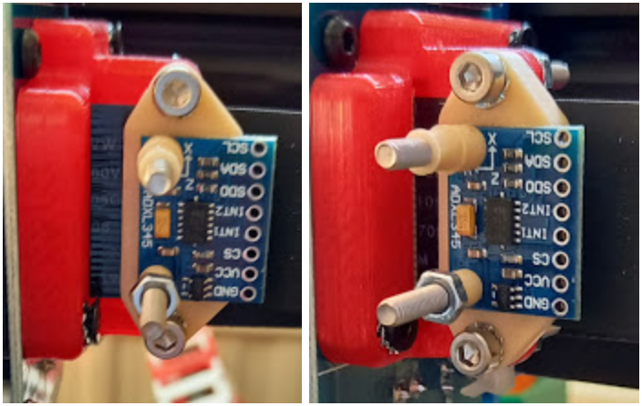
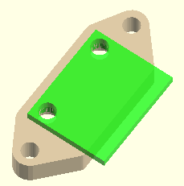
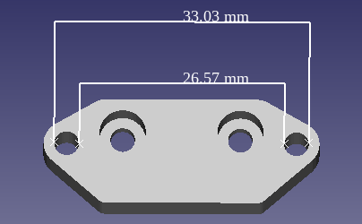

# ADXL345 accelerometer mount for Artillery Genius/Sidewinder
- Files also available in [Thingiverse](https://www.thingiverse.com/)
- Meant to be used for [Klipper's input shaping](https://www.klipper3d.org/Measuring_Resonances.html )
- Designed with [OpenSCAD](https://openscad.org/cheatsheet/), see also `./adxl.scad`

## clamp_screwdist

Calculate `clamp_screwdist` by first measuring the distance between the two clamping bolts, and then calculating their average (see the picture): `(33.03 + 26.57)/2`. Then divide the resulting value in two, and we get `clamp_screwdist = 29.8/2 = 14.9`.

`adxl_screwdist` can be calculated with a similar process by measuring the mounting holes in the ADXL345 PCB.

### Some already calculated values:
- [Artillery Genius strain relief](https://www.thingiverse.com/thing:4281143)
  - clamp_screwdist = (33.03+26.57)/4 = 14.9
- [X1 svandru](https://www.thingiverse.com/thing:4100016)
  - clamp_screwdist = (31.57+24.49)/4 = 14.015 $\\approx$ 14.02
- [X1 hara74](https://www.thingiverse.com/thing:3945539)
  - clamp_screwdist = (31.20+24.80)/4 = 14.0
