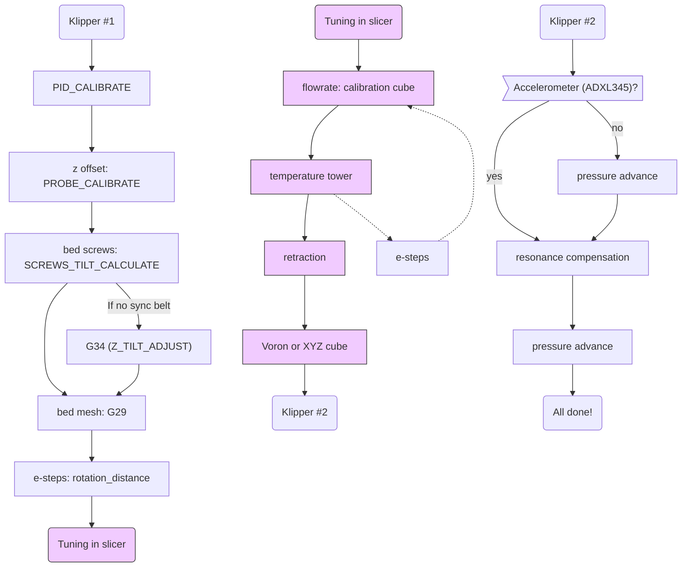

```mermaid
graph TB
    Klipper1("Klipper #1")
    Klipper1 --> pid
    pid["PID_CALIBRATE"]
    pid --> A["z offset: PROBE_CALIBRATE"]
    Ztilt["G34 (Z_TILT_ADJUST)"]
    A --> B["bed screws: SCREWS_TILT_CALCULATE"]
    B --> C["bed mesh: G29"]
    B -->|"If no sync belt"| Ztilt
    Ztilt --> C
    Esteps["e-steps: rotation_distance"]
    C --> Esteps
    Esteps --> ST1("Tuning in slicer")
    %%Esteps --> ST

    ST("Tuning in slicer")
    ST --> Flow["flowrate: calibration cube"]
    Flow --> Temp["temperature tower"]
    Temp --> Retr["retraction"]
    Temp -.-> Estep2["e-steps"] -.-> Flow
    Retr --> Calib["Voron or XYZ cube"]
    Calib --> Klip2("Klipper #2")

    %%Calib --> Adxl
    Klip3("Klipper #2")
    Klip3 --> Adxl
    Adxl>"Accelerometer (ADXL345)?"]
    Adxl -->|yes| RES["resonance compensation"]
    Adxl -->|no| PA["pressure advance"] --> RES
    RES --> PA2["pressure advance"]
    PA2 --> Rdy("All done!")


    classDef one fill:#f1cbff,stroke:#333,stroke-width:1px;
    classDef two fill:#ffbdbd,stroke:#333,stroke-width:1px;
    %%class Klip2,Klip3 one;
    class ST,ST1 one;
    class Flow,Temp,Retr,Calib one;
```
