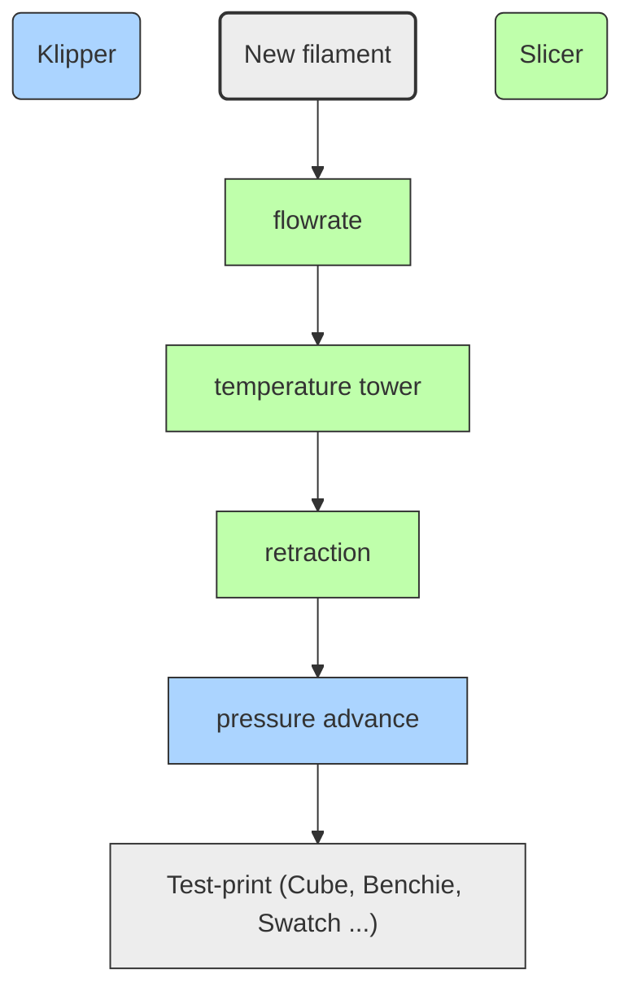

```mermaid
graph TB
  Klip("Klipper")

  NF("New filament")
  NF --> Flow["flowrate"]
  Flow --> Temp["temperature tower"]
  Temp --> Retr["retraction"]
  %%Temp -.-> Estep2["e-steps"] -.-> Flow
  Retr --> PA
  PA["pressure advance"]

  PA --> Check["Test-print (Cube, Benchie, Swatch ...)"]

  Slicer("Slicer")
  %% stroke-dasharray: 10 3
  classDef one fill:#ededed,stroke:#333,stroke-width:2px;
  classDef two fill:#bfffab,stroke:#333,stroke-width:1px;
  classDef three fill:#abd4ff,stroke:#333,stroke-width:1px;
  classDef four fill:#ededed,stroke:#333,stroke-width:1px;
  %%class Klip2,Klip3 one;
  class NF one;
  class Slicer,Flow,Temp,Retr two;
  class Klip,PA three;
  class Check four;
```
